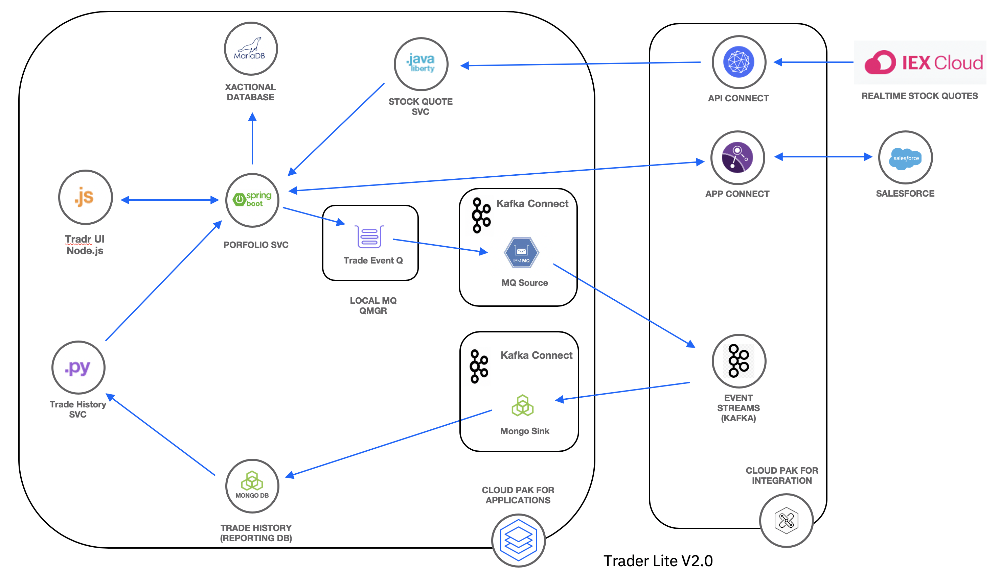

#  Trader Lite - Portfolio Service for IBM Cloud Pak for Integration

The IBM Trader Lite application is a simple stock trading sample where you can create various stock portfolios and add shares of stock to each for a commission. The app is used to illustrate concepts in IBM Cloud Pak for Integration workshop taught by IBM Client Developer Advocacy



The **portfolio** microservice is a Spring  Boot app that sits at the center of the application. This microservice:

   * persists trade data  using JDBC to a MariaDB database
   * invokes the **stock-quote** service that invokes an API defined in the API Connect component of CP4I to get stock quotes
   * sends trades indirectly via a local MQ qmgr to Event Streams in CP4I  so that they can be recorded in MongoDB by the **Kafka Connect** microservice
   * calls the **trade-history** service to get aggregated historical trade  data.
   * pushes new client data to Salesforce via the AppConnect component of CP4I
   * links an external bank account via AppConnect component of CP4I

## Building the Portfolio Service

This is a Spring Boot app built and tested with OpenJDK 1.8. Enter the following command from the root of the repo:

```
mvn clean package
```

A Spring Boot *fat jar* will be built in the **target** folder.

The included [Dockerfile](Dockerfile) can be used to create an image for deployment to Kubernetes.

## Deploying the Portfolio Service

Refer to the IBM Cloud Pak for Integration workshop instructions on how this service is deployed as part of the Trader Lite app.
